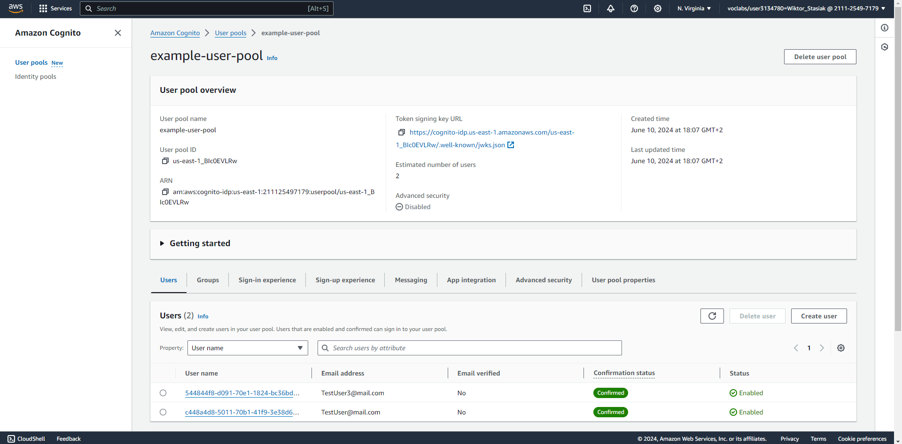
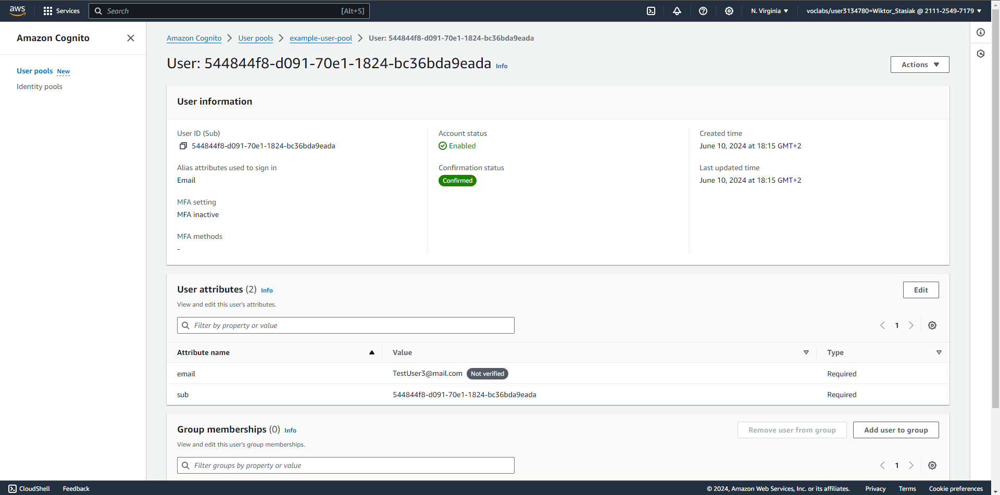
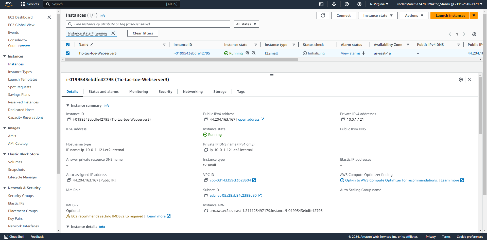
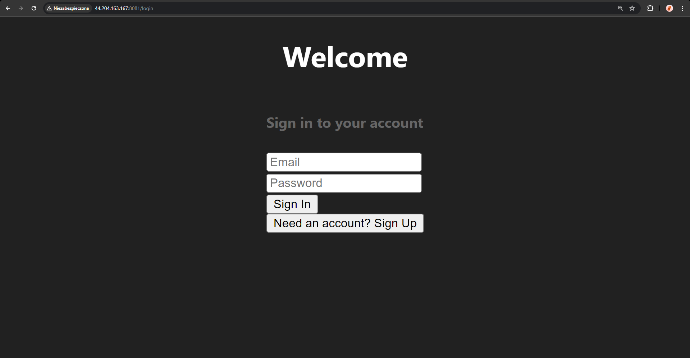
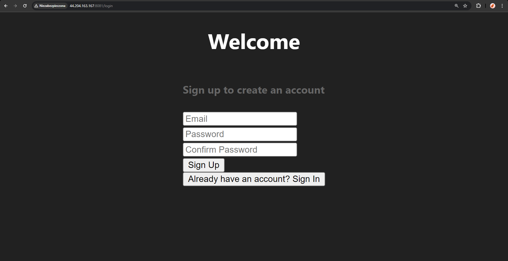
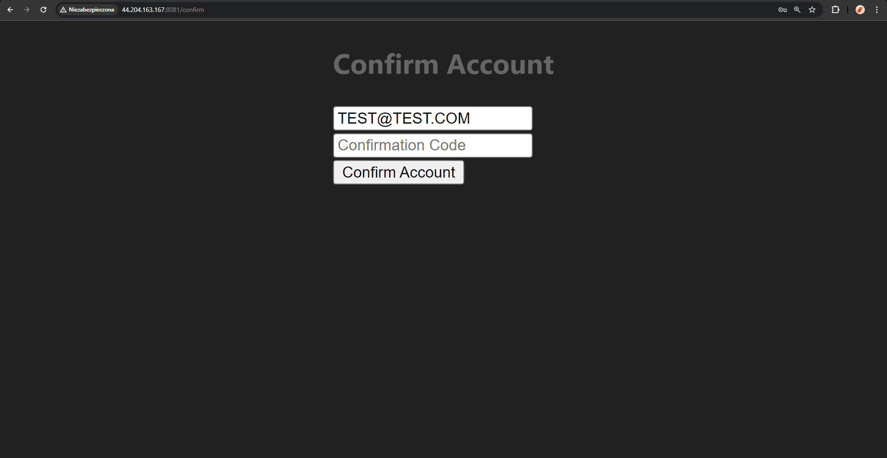
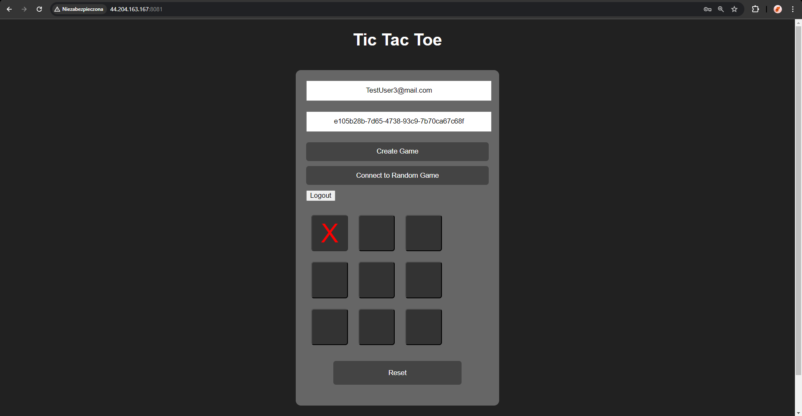

# Wiktor Stasiak - AWS Cognito, TicTacToe report

- Course: *Cloud Programming*
- Group: W04IST-SI4527G
- Date: June 10, 2024

## Environment Architecture

The primary focus of this project was the integration of AWS Cognito for user authentication in a TicTacToe game application. The environment setup involved using Terraform to provision necessary AWS resources, including a VPC, subnets, an internet gateway, route tables, security groups, and an EC2 instance running Docker containers for the frontend and backend services.

### AWS Cognito Setup:
- **User Pool**: Created to manage user sign-up and sign-in functionality.
  - **Username Attributes**: Set to email for unique user identification.
  - **Password Policy**: Configured with minimum length, and requirements for uppercase, lowercase, numbers, and symbols.
  - **Verification Message Template**: Customized for email verification during user sign-up.
  - **Schema**: Defined to ensure email is a required attribute.

- **User Pool Client**: Configured to interact with the user pool, enabling the application to authenticate users.
  - **Auth Flows**: Enabled user password authentication and refresh token authentication.

### AWS Resources Created:
- **VPC**: A virtual private cloud with CIDR block `10.0.0.0/16`.
- **Subnet**: A subnet within the VPC with CIDR block `10.0.1.0/24`.
- **Internet Gateway**: To allow internet access.
- **Route Table**: Associated with the subnet and configured to route traffic through the internet gateway.
- **Security Group**: Allowing SSH (port 22), HTTP (port 8080), and custom TicTacToe ports (port 8081).
- **EC2 Instance**: Running a Docker environment to host the TicTacToe application.

## Preview (screenshots)
### Configured AWS Services

- **AWS Cognito User Pool Configuration**:
  
  

- **EC2 Instance**:
  

- **Running App**:
    
    
  
  

## Reflections
### What did you learn?

This project provided in-depth knowledge about AWS Cognito and its capabilities in managing user authentication. I learned how to set up and configure a Cognito User Pool, customize its settings for secure authentication, and integrate it with an application. The process of configuring the user pool client to handle authentication flows was particularly insightful, showing how AWS services can be leveraged to enhance application security.

### What obstacles did you overcome?

One of the main challenges was understanding and correctly configuring AWS Cognito to meet the application's authentication requirements. This included setting up the user pool, defining password policies, and configuring the user pool client. Additionally, ensuring the backend service could securely access AWS Cognito and handle user authentication tokens required careful management of credentials and permissions.

### What helped most in overcoming obstacles?

The detailed AWS Cognito documentation and community forums were invaluable in overcoming configuration challenges. Terraform's plan and apply features provided clear feedback on infrastructure changes, which helped in troubleshooting issues. Practical examples and best practices for managing AWS credentials and IAM roles were also crucial in securely integrating AWS Cognito with the backend service.

### Was there something that surprised you?

I was pleasantly surprised by the flexibility and power of AWS Cognito in managing user authentication. The ease with which complex authentication flows can be configured and managed through Cognito was impressive. Additionally, the seamless integration of AWS Cognito with other AWS services and its capability to handle user management at scale was an eye-opener.

Overall, this project significantly enhanced my understanding of AWS Cognito and its application in real-world scenarios, providing a strong foundation for managing secure user authentication in cloud-based applications.
